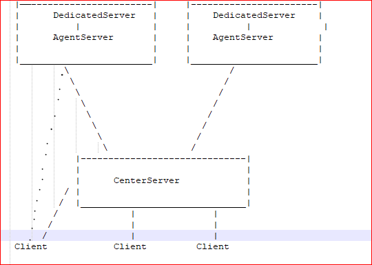

# TankFire
this is a online shoot game, just like other.io game.

In 2016, I developed a simple .io shoot game with Unity(Mobile and PC),while the server I create with c++ and need to process
physics on the server, so you need to export the game scene physics to the server. And the server I use PhysX to load the 
physic scene and do the move and bullet shoot. It's hard to debug, to develop the server is not easy.

After that, I see the unreal engine4, I think it's time to use unreal engine 4 to develop .io like game, with unreal engine 4,
I can build the project to dedicated server, and this saved me a lot of time. this game should works on PC, mobile and HTML5.
Finaly I finished the basic game, and you here is the html5 version(some particles have bug, so I disable it on html5 platform), 
you can use latest firefox to play [this game](http://50.116.0.118). And here is the [youtube video](https://youtu.be/GOS8iBXGaEU).

If you have any problem, please email me:feixuwu@outlook.com.

# Supported Platform
★ 1. Win64

★ 2. [Android](https://play.google.com/store/apps/details?id=com.anyfun.TankCrash)

★ 3. IOS

★ 4. UWP

★ 5. [HTML5](http://50.116.0.118)

★ 6. Linux

# Supported Engine Version

Current Only test with 4.18.

# Architecture

  Here is the basic Server architecture:
    
    
   As you can see, the client first connect to the CenterServer login and query basic player infomation.
   And then when player click the play button, It will join a queue to wait other player join, if found enough player to begin a match,
   then the CenterServer will select an AgentServer and ask the AgentServer to start a decicated server to process this players.
   
   After the dedicated Server started, the client will receive the target dedicated server infomation(ip and port), then login the dedicated server. After the game finished, the dedicated server will automatic exit and terminated it's self.
  
# Quick Run

to help people run the game on local machine, I upload a package on [here](https://www.dropbox.com/s/44uynbou53tj7wt/TankFire.7z?dl=0),you can first run the startserver.sh, and then start client to join game, since the config bind address is 127.0.0.1, you can only play game on your local machine with this package.

## install nodejs
  Because the CenterServer And AgentServer are run by nodejs, you first need install nodejs,here is the [link])(https://nodejs.org/en/).
  
## install redis
   The CenterServer need a redis server to write the account data. If you PC is run with windows 10, you can 
   install ubuntu from the windows store. And then open the ubuntu run this command to install redis:
   
    apt-get install redis-server
   
   After install finished, you need to start the redis server, run the command:
   
    /etc/init.d/redis-server start
   
  At last, you can telnet 127.0.0.1 6379 to test if the redis can reach.
  
## Configure Server

   The Server config file is under Server/Config/config.json.
   you can change all the ip address with 127.0.0.1 for simple test.
  
## Start CenterServer
  Open the windows cmd, and go to the CenterServer directory(Server/CenterServer/), run the command:
  node js/CenterServer.js
  
## Start Dedicated Server
  Run the runserver.bat under the project root folder.Please remember, If your engine is install on other directory,
  you may need edit the runserver.bat, change the "D:\Program Files\Epic Games\UE_4.18\Engine\Binaries\Win64\UE4Editor.exe"
  to your editor path.
  
## Run Client from editor
  Open the project with unreal engine 4 (4.18), and click play, It will show the main menu and you can play with it.

   
# Server

★ CenterServer And AgentServer

  The CenterServer and AgentServer is write by typescript, so to run the server, you need first install nodejs.
  And then configure the server config file under the Server/Config/. The CenterServer also need a redis server to read and save
  the account info. If you run on windows 10, you can enable the bash linux system and use apt-get to install a redis server.
  
  
★ Dedicated Server

  The dedicated server, you can build it for linux and windows, or just test on editor by run the runserver.bat.
  If you want the dedicated server work for html5 client, you need configure the DefaultEngine.ini to let the engine use 
  WebSocketNetworkDriver, just add this to the default engine.ini:
  
 [/Script/Engine.GameEngine]
 
!NetDriverDefinitions=ClearArray

+NetDriverDefinitions=(DefName="GameNetDriver", DriverClassName="/Script/WebSocketNetworking.WebSocketNetworkNetDriver",
DriverClassNameFallback="/Script/WebSocketNetworking.WebSocketNetworkNetDriver")

# Plugins
 
★ Adcollection
  This is an ads plugin to make money, the dedail is [here](https://github.com/feixuwu/UnrealEngine4-Admob).
  
★ WebSocket
  This is a Websocket plugin, and include a protocol tool to automatic generate code for server with typescript and unreal engine 4
with c++.

★ EZOnline
  This is the core plugin for play online, It process the basic client login and join game, with this plugin, it can be very easy to 
  make a standalone game to an online game.
  
★ WebSocketNetworking
  This is a NetDriver for HTML5. beacuse the engine HTML5Networking have critical bug on server, So I create this plugin for HTML5.
  
 
# LICENSE
 See [License](LICENSE);

  
